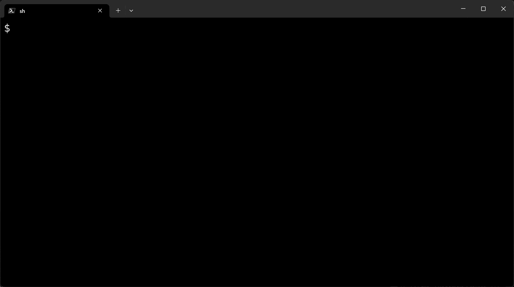

# Subdomain Crawler

The program aims to help you collect subdomains of a list of given second-level domains (SLD).



## Usage

1. Edit input file `input.txt`

```bash
$ head input.txt
tsinghua.edu.cn
pku.edu.cn
fudan.edu.cn
sjtu.edu.cn
zju.edu.cn
```
2. Run the program

```bash
$ ./subdomain-crawler --help
Usage:
  subdomain-crawler [OPTIONS]

Application Options:
  -i, --input-file=    The input file (default: input.txt)
  -o, --output-folder= The output folder (default: output)
  -t, --timeout=       Timeout of each HTTP request (in seconds) (default: 4)
  -n, --num-workers=   Number of workers (default: 32)
  -d, --debug          Enable debug mode
  -v, --version        Version

Help Options:
  -h, --help           Show this help message

$ ./subdomain-crawler
```
3. Check out the result in `output/` folder.

```bash
$ head output/*
```
